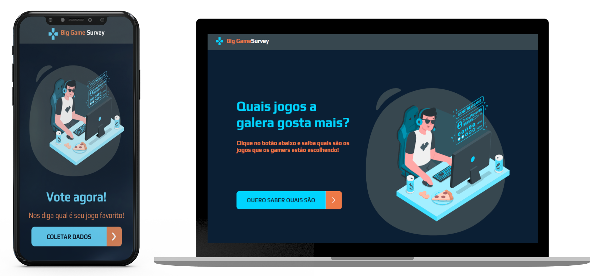

# SemanaDevSuperior
<h1 align="center">
    
</h1>

<h4 align="center">
  💻 Semana Dev Superior 1 | Prof. Nélio Alves
</h4>

 

  

  <a href="#robot-tecnologias">Tecnologias</a>&nbsp;&nbsp;&nbsp;|&nbsp;&nbsp;&nbsp;
  <a href="#-projeto">Projeto</a>&nbsp;&nbsp;&nbsp;|&nbsp;&nbsp;&nbsp;
  <a href="#-layout">Layout</a>&nbsp;&nbsp;&nbsp;|&nbsp;&nbsp;&nbsp;

 

  

## :robot: Tecnologias

Esse projeto Big Game Survey foi desenvolvido com as seguintes tecnologias:

- [Java](https://openjdk.java.net/)
- [Spring Framework](https://spring.io/)
- [PostgreSQL](https://www.postgresql.org/)
- [Node.js](https://nodejs.org/en/)
- [React](https://reactjs.org)
- [React Native](https://facebook.github.io/react-native/)
- [Expo](https://expo.io/)

## 💻 Projeto

O projeto desenvolvido dutrante a Semana Dev Superior faz a coleta de respostas de gamers por meio de aplicativo mobile (expo) em react-native sobre quais o jogos preferidos dos gamers, com informações como nome, idade, plataforma e gênero do jogo e os exibe em forma de tabela/gráficos.
Front-end web em React e o Backend desenvolvido em Java + Spring com banco de dados gerenciado pelo PostgreSQL. 

## :heavy_check_mark: Acesso

- [App Web | Netlify Deploy](https://sdevsuperior1-tao.netlify.app/)
- [Backend | Heroku](https://sdevsuperior1-tao.herokuapp.com/)

## 🔖 Layout

Você pode visualizar o layout do projeto no formato através [desse link](https://www.figma.com/file/KT3Z1EgTE6EovJwR4AV43j/BigGameSurvey). (FIGMA).

## :notebook: Material de Apoio
- [Github taohansens/sds1 Repo](https://github.com/taohansens/sds1)

---
